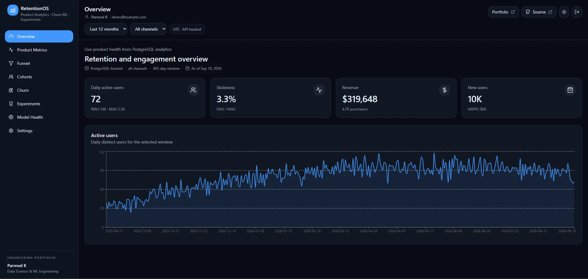
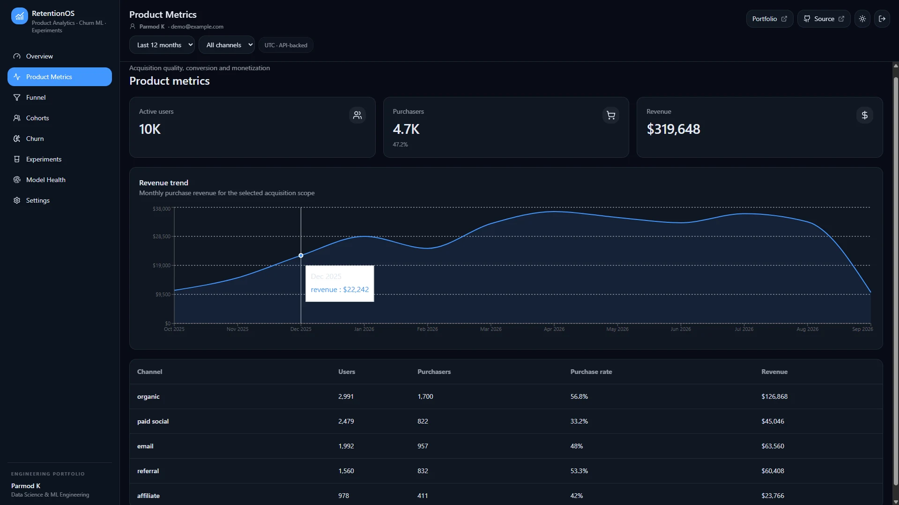
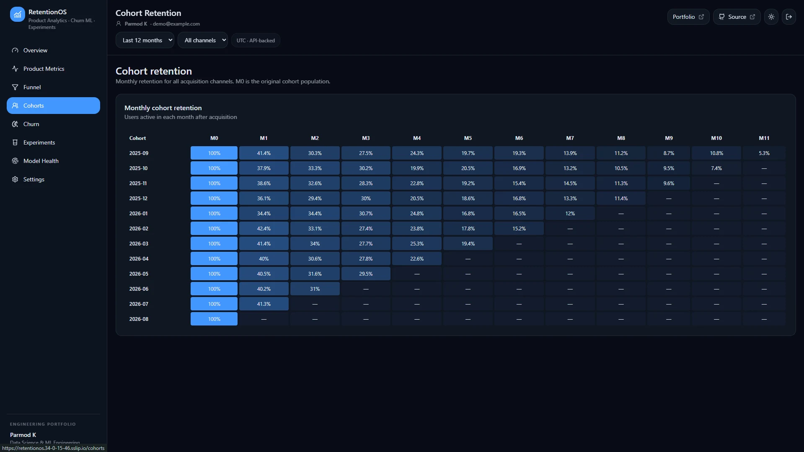
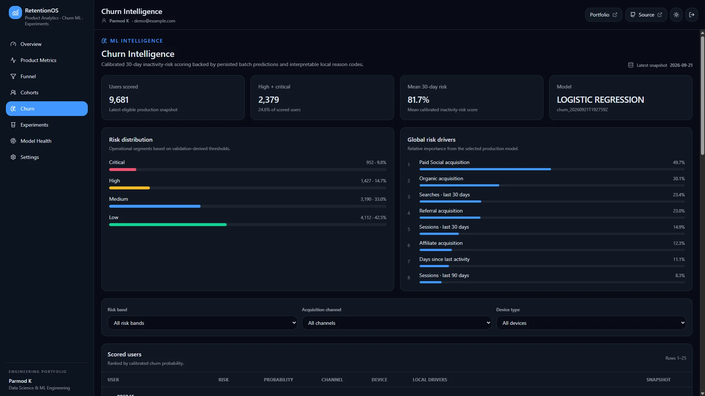
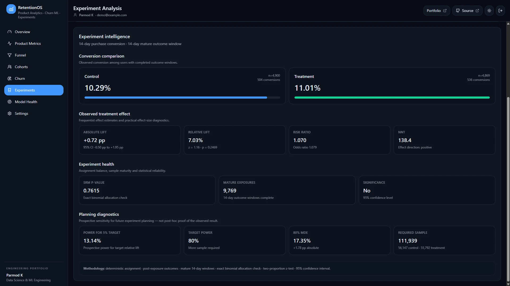
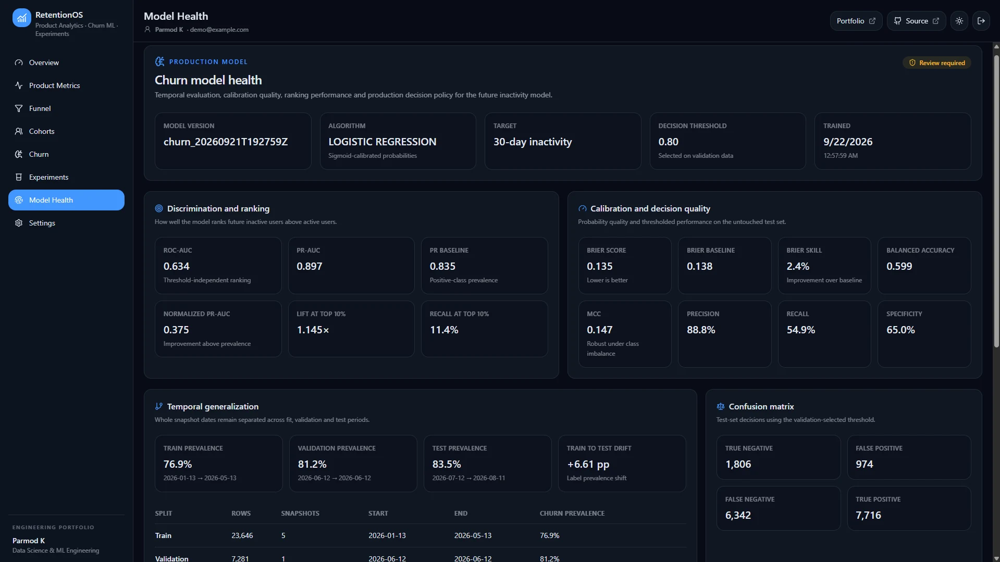
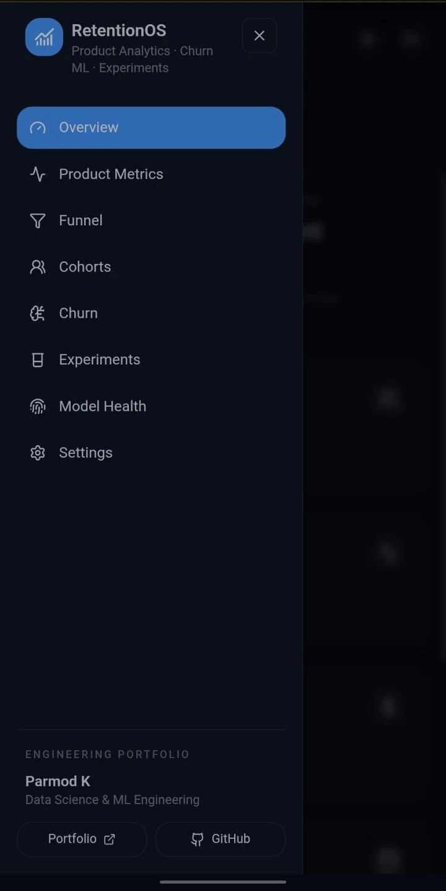
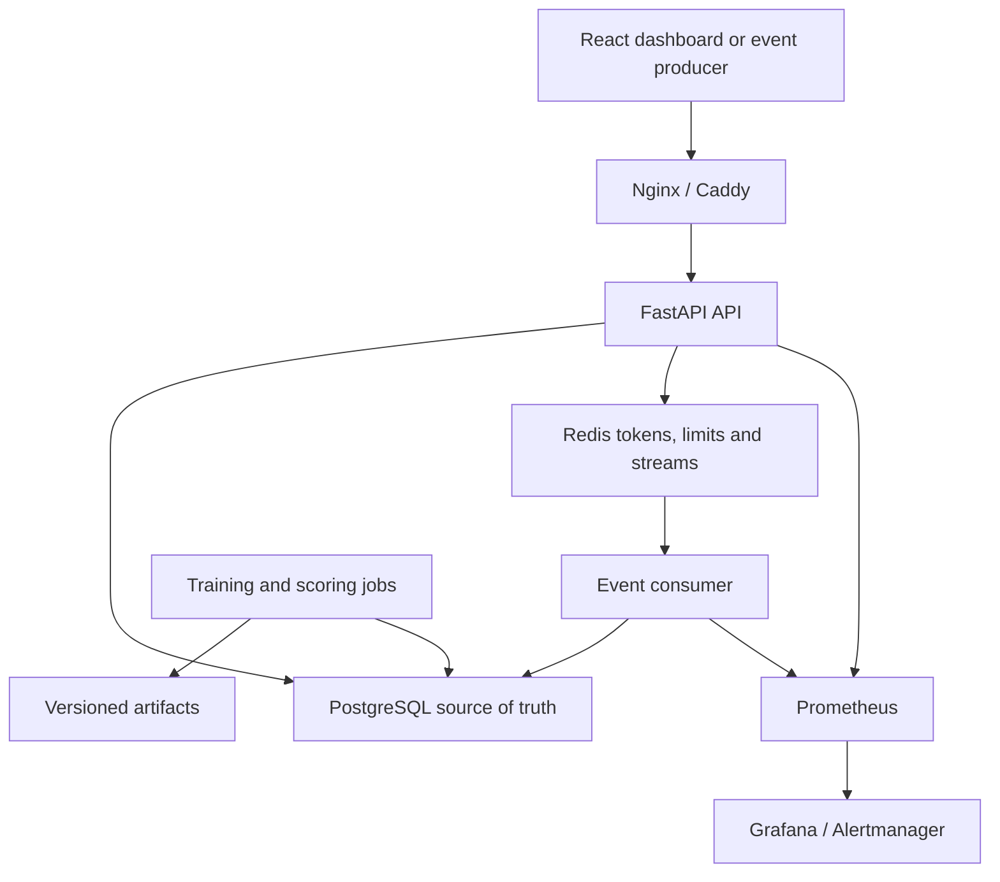
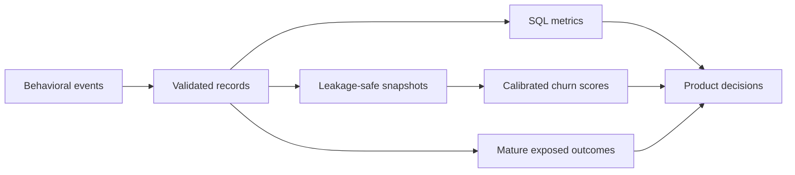

# RetentionOS — Product Analytics, Churn Intelligence & Experimentation

[](https://github.com/Parmodk2310/retention-analytics-platform/actions/workflows/ci-backend.yml)
[](https://github.com/Parmodk2310/retention-analytics-platform/actions/workflows/ci-frontend.yml)
[](https://github.com/Parmodk2310/retention-analytics-platform/actions/workflows/security.yml)
[](LICENSE)

RetentionOS is a product analytics and ML engineering system that combines behavioral event
ingestion, SQL analytics, calibrated churn scoring, A/B experimentation and operational monitoring.
The public demo uses synthetic data; it does not represent production customer traffic or customer
data.

> **Live demo:** https://retentionos.34-0-15-46.sslip.io/
>
> **Demo scale:** 10K synthetic users · ~238K product events
>
> **Runtime:** Google Compute Engine · Docker Compose · Caddy HTTPS
>
> **Boundary:** public demonstration environment using synthetic data; not production customer traffic.



## Problem

Product teams often analyze funnel drop-off, acquisition quality, churn risk, treatment effects and
data reliability in separate tools. That fragmentation can produce inconsistent definitions and
break the link between analysis and operational behavior. RetentionOS keeps these concerns in one
system so ingestion, analytics, scoring, experimentation and delivery can be inspected together.

## What it delivers

| Capability | Implementation | Decision supported |
|---|---|---|
| Product analytics | DAU/WAU/MAU, stickiness, revenue and channel performance | Where product health is changing |
| Funnel analysis | Ordered stage progression and drop-off | Where to investigate conversion loss |
| Cohort retention | Monthly acquisition cohorts | Whether engagement persists over time |
| Churn intelligence | Temporal validation, calibration, persisted scores and interpretable reason codes | Which users warrant retention attention |
| Experimentation | Assignment, exposure, SRM, intervals and power | Whether evidence supports shipping |
| Event reliability | Redis Streams, recovery, retries, DLQ and idempotent writes | Whether behavioral data is trustworthy |
| Operations | Health probes, metrics, dashboards, alerts and structured logs | Whether the platform is behaving normally |
| Delivery | Docker Compose, gated workflows and modular Terraform | How the system can be reproduced and operated |

The public demonstration currently contains 10,000 synthetic users and approximately 238K
product events. Synthetic data supplies known channel, churn and treatment effects without exposing
customer data.

## Product walkthrough

### Diagnose product and acquisition performance

SQL-backed metrics keep business definitions inspectable and reusable across the API and UI.

| Product and channel metrics | Monthly retention cohorts |
|---|---|
|  |  |

### Prioritize retention work

Offline jobs create versioned model artifacts and persisted user-level scores. The application
serves calibrated risk bands and persisted diagnostic reason codes without retraining inside an API request.



### Evaluate a product change

Experiment analysis separates assignment from exposure, checks sample-ratio mismatch, reports
absolute and relative effects, and presents uncertainty and planning diagnostics before a decision.



### Inspect model governance

Model health exposes temporal splits, ranking and calibration metrics, the selected threshold,
confusion matrix and dataset contract. A review warning is intentional when quality policy requires
human attention; it is not silently converted into a positive status.



### Responsive navigation

The dashboard includes a responsive navigation drawer so the same workflows remain usable on
smaller screens without changing the underlying analytics or API behavior.

<p align="center">
  
</p>

## Architecture



PostgreSQL owns durable product, experiment and score records. Redis provides operational state and
at-least-once event transport. Offline jobs own training and batch scoring. This separation keeps
request latency independent of model fitting and makes persisted results auditable.

Read the [system design](docs/architecture/system-design.md), [data model](docs/architecture/data-model.md),
[event pipeline](docs/architecture/event-pipeline.md) and [ML design](docs/architecture/ml-design.md).

## Analysis flow



The critical time boundaries are explicit: churn features precede the future label window, and
experiment outcomes are counted only after exposure and outcome maturity.

## Engineering decisions

- **SQL-first analytics:** KPI definitions remain close to the relational source of truth and can
  be inspected with query plans. See [ADR-0002](docs/architecture-decisions/0002-sql-first-analytics.md).
- **Assignment is not exposure:** never-exposed users do not dilute treatment estimates.
- **At-least-once, idempotent ingestion:** messages are acknowledged after persistence; stable
  event IDs and database uniqueness make retries safe.
- **Offline model lifecycle:** preprocessing, estimator and metadata are versioned together; API
  requests read persisted scores.
- **Temporal evaluation:** whole snapshot dates remain separated across fit, calibration,
  validation and test boundaries.
- **Two deployment goals:** the public demo runs on Google Compute Engine using the
  production Docker Compose stack; AWS Terraform remains the scalable reference architecture.
- **No Kubernetes by default:** it adds operational surface without improving this workload.

## Verified evolution

| Milestone | Verifiable outcome |
|---|---|
| Analytics foundation | Parameterized activity, funnel, cohort, revenue and channel queries |
| Churn lifecycle | Leakage tests, temporal evaluation, calibration, lineage and persisted scoring |
| Experimentation | Deterministic allocation, exposure integrity, SRM, inference and power |
| Event pipeline | Pending recovery, bounded retry, DLQ and idempotent persistence |
| Platform hardening | Authentication, rate limits, health probes, monitoring and security scans |
| Cloud architecture | AWS Terraform reference architecture and gated deployment workflow |
| Public demo deployment | Google Compute Engine with Docker Compose, Caddy and HTTPS |

The Phase 7 freeze recorded 167 passing backend tests with four skipped, eight passing frontend
tests, clean secret/dependency audits, healthy monitoring targets and a 2,000-event reliability
benchmark ending with zero backlog, pending messages and consumer lag. These are historical
validation results, not permanent service-level guarantees.

See the [phase ledger](docs/PHASES.md) and [system review guide](docs/system-review.md).

## Technology

| Layer | Technologies |
|---|---|
| Frontend | React 18, TypeScript, Vite, TanStack Query, Zustand, Recharts, Tailwind CSS |
| API | Python 3.12, FastAPI, Pydantic, SQLAlchemy, Alembic |
| Data | PostgreSQL, parameterized SQL, synthetic data generator |
| Streaming | Redis Streams, consumer groups and dead-letter queue |
| ML | scikit-learn, calibrated logistic regression, optional XGBoost/SHAP tooling, joblib and temporal evaluation |
| Experimentation | Deterministic hashing, SRM tests, two-proportion inference and power analysis |
| Observability | Prometheus, Grafana, Alertmanager, structured logging and optional Sentry |
| Delivery | Docker Compose, GitHub Actions, Terraform, Google Compute Engine, AWS reference IaC and Caddy |

The complete inventory is in [docs/DEPENDENCIES.md](docs/DEPENDENCIES.md).

## Deployment and infrastructure

| Target | Current state |
|---|---|
| Local Docker environment | Implemented and smoke-tested |
| CI and security checks | Backend, frontend, Gitleaks and Trivy workflows implemented |
| AWS reference architecture | Terraform retained as a reference deployment path |
| Public GCP demo environment | Live on Google Compute Engine with six-service Docker Compose |
| Public application URL | https://retentionos.34-0-15-46.sslip.io/ |

The AWS design includes ECS Fargate, RDS, ElastiCache, ALB, ECR, private S3/CloudFront delivery,
monitoring and scheduled tasks. `AWS_DEPLOY_ENABLED=false` remains the cost and authorization gate.

The public GCP deployment runs Caddy, frontend, API, event worker, PostgreSQL and Redis on a
single Compute Engine VM while exposing only the HTTPS gateway. The repository also retains the
single-node Compose deployment assets and AWS Terraform reference architecture. See the
[GCP public-demo runbook](docs/runbooks/gcp-public-demo.md) and
[Terraform security decisions](infrastructure/terraform/SECURITY.md).

CI validates repository checks; runtime availability is verified separately through the public
HTTPS endpoint and API health checks.

## Quick start

Requirements: Docker, Docker Compose v2 and Git.

```bash
git clone https://github.com/Parmodk2310/retention-analytics-platform.git
cd retention-analytics-platform
cp .env.example .env
# Replace development placeholders before use.
docker compose up -d postgres redis
docker compose run --rm backend alembic upgrade head
docker compose up -d backend event-worker frontend
```

Open the dashboard at <http://localhost:8080>, OpenAPI at <http://localhost:8000/docs>, liveness at
<http://localhost:8000/api/v1/health/live> and metrics at <http://localhost:8000/metrics>.

Generate data, train and score:

```bash
docker compose --profile tools run --rm data-generator python seed.py
docker compose --profile tools run --rm data-generator python validate.py
docker compose run --rm backend python -m app.ml.train
docker compose run --rm backend python -m app.jobs.score_churn
```

## Quality gates

```bash
cd backend
pip install -r requirements-dev.txt
ruff check app tests
python -m compileall -q app
pytest -q
bandit -q -r app -x app/ml/artifacts
pip-audit -r requirements.txt
```

```bash
cd frontend
npm ci
npm run lint
npm test
npm run build
```

Pull requests also run Gitleaks and Trivy. Third-party workflow actions and production container
bases are pinned to immutable references.

## Repository map

| Path | Responsibility |
|---|---|
| `backend/app/api/` | Versioned HTTP contracts, authentication and validation |
| `backend/app/analytics/` | SQL-backed product metrics |
| `backend/app/ml/` | Feature snapshots, training, evaluation and artifacts |
| `backend/app/experiments/` | Assignment, SRM, inference and decisions |
| `backend/app/realtime/` | Redis Streams transport and recovery |
| `backend/app/jobs/` | Event consumer and offline scoring jobs |
| `frontend/` | Analyst-facing React application |
| `data-generator/` | Reproducible synthetic product behavior |
| `monitoring/` | Dashboards, metrics and alert rules |
| `infrastructure/terraform/` | AWS reference architecture |
| `infrastructure/oci/` | Retained alternative single-node deployment path |
| `docs/` | Contracts, architecture, ADRs, runbooks and security model |

## Documentation

- [Documentation index](docs/README.md)
- [API contracts](docs/api-contracts/README.md)
- [Architecture decisions](docs/architecture-decisions/)
- [Threat model](docs/security/threat-model.md)
- [Operational runbooks](docs/runbooks/)
- [Repository guide](docs/Project_Guide.md)

## Current limitations

- The dataset is synthetic; displayed findings are demonstrations, not customer outcomes.
- The public GCP demo is single-node and not highly available.
- AWS Terraform is retained as a reference architecture and is not the active public deployment.
- The public demo uses synthetic data and is intended for demonstration and technical review rather than customer traffic.
- Legacy `/ml/churn/*` handlers are not the active scoring interface; the dashboard reads persisted
  `/churn/*` results.
- Production use with real data requires organization-specific privacy, backup, recovery,
  access-review and compliance controls.

## Responsible use

Retention scores are prioritization signals, not facts about a person. Do not use them for punitive,
high-impact or discriminatory decisions. Before processing real customer data, define lawful use,
retention periods, access controls, human review, fairness monitoring and deletion procedures.

This repository is an independent reference implementation and is not affiliated with a
commercial product of the same or a similar name.

## License

Licensed under the [Apache License 2.0](LICENSE). Synthetic sample data and project documentation
are provided for portfolio and educational use under the same license unless noted otherwise.
